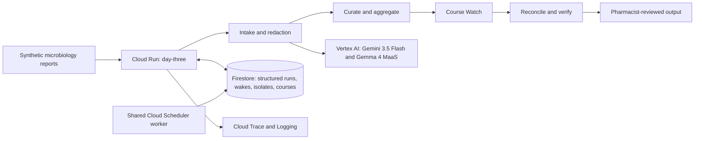

# Day Three

**An agentic antimicrobial-stewardship console for small and critical-access hospital teams.**

Day Three turns synthetic microbiology reports into a privacy-protected local antibiogram,
maintains a five-week antibiotic-course review ladder, and produces source-grounded reconciliation
recommendations for pharmacist review. It does **not** prescribe, contact clinicians autonomously,
or claim hospital-wide coverage from its small demonstration dataset.

- [Live application](https://day-three-109051079423.us-central1.run.app)
- [Judge evidence](https://day-three-109051079423.us-central1.run.app/judges)
- [Machine-checkable conformance](https://day-three-109051079423.us-central1.run.app/conformance)

## Verified evidence

| Gate | Result |
|---|---:|
| Public acceptance flow | **17/17** |
| Standalone tests | **186 passed** |
| Recorded extraction fields | **29/29** |
| Shared substrate exit test | **10/10** |
| Accessibility gate | **Pass, light and dark themes** |

The measured recordings, adjacent truth files, test suite, and acceptance script are committed.
These are reproducible gates, not estimates.

## The problem

Small hospital stewardship teams often work with limited specialist time and limited local data.
Day Three focuses on the coordination gap between a microbiology result, a local cumulative view,
the 48-to-72-hour review moment, and a human pharmacist decision. The product keeps the source,
uncertainty, review status, and safety boundary visible throughout that chain.

## What it does

1. **Intake:** transcribes a synthetic microbiology report and redacts direct identifiers before
   model-bound text crosses the trust boundary.
2. **Curate:** normalizes organism and susceptibility fields, preserves source provenance, and
   rejects unsupported values.
3. **Aggregate:** builds a deliberately small local antibiogram with cumulative labels and honest
   coverage warnings.
4. **Watch:** registers the complete antibiotic-course reminder ladder up front.
5. **Reconcile:** prepares a cited recommendation for pharmacist review; the router only prepares
   an escalation and never contacts a clinician.

## Architecture



The eight “agents” are logical Python roles and route stages inside one `day-three` Cloud Run
service. They are not separate services, do not communicate through Pub/Sub, and run under the
deployed `sa-reason` identity. The existing `spine-scan-due` job invokes a shared worker that
claims due wakes from the same Firestore substrate.

The two public submissions deliberately share durable infrastructure but not demo time.
`day-three` uses its own Firestore simulation-clock document, and `POST /sim/advance` filters
due candidates by the owning run's project before claiming them. The production scheduler remains
an unfiltered shared worker on wall-clock time. A Sixty Days rehearsal therefore cannot move Day
Three's clock or consume one of its demonstration wakes.

The source version of the diagram is in [`docs/architecture.mmd`](docs/architecture.mmd).

## Reproduce locally

Prerequisites: Python 3.12 and, for live model calls, Application Default Credentials for a Google
Cloud project with Vertex AI enabled.

```bash
cd app
python -m venv .venv
.venv/bin/pip install -e ".[dev]"
python -m pytest -q
python scripts/check_a11y.py
```

Run deterministically with the committed recordings:

```bash
export GOOGLE_CLOUD_PROJECT=agentic-fleet-2026
export SIM_MODE=true
export REPLAY_MODE=true
uvicorn service.main:app --reload
python scripts/demo_flow.py --url http://127.0.0.1:8000
curl -X POST -H "Content-Type: application/json" -d '{}' http://127.0.0.1:8000/exit-test
```

Deploying from `app/` with `bash deploy.sh` targets the independent Cloud Run service `day-three`.

## Safety and data boundaries

- Synthetic composite reports only; no protected health information or real patient records.
- Redaction combines deterministic patterns with a Gemma reviewer, and tests cover all shipped
  fixture identifiers.
- Recommendations must cite observable source fields; the verifier can abstain.
- The local antibiogram is labeled cumulative and limited to the demonstrated sample.
- No autonomous prescribing, messaging, paging, ordering, or chart mutation.

## Research basis

The problem and workflow are grounded in primary or peer-reviewed sources, including the
[CDC Core Elements for Small and Critical Access Hospitals](https://www.cdc.gov/antibiotic-use/media/pdfs/core-elements-small-critical-508.pdf),
the [CDC hospital stewardship core elements](https://www.cdc.gov/antibiotic-use/hcp/core-elements/hospital.html),
the [2024 GRAM analysis](https://pubmed.ncbi.nlm.nih.gov/39299261/), and the
[21-program Iowa/Nebraska evaluation](https://pmc.ncbi.nlm.nih.gov/articles/PMC10594270/).
The public interface uses scoped denominators and does not generalize those study samples to all
hospitals.

Three newer sources sharpen the product position:

- CDC's [2025 national update](https://www.cdc.gov/antibiotic-use/hcp/data-research/stewardship-report.html)
  reports that 97% of acute-care hospitals reported all seven Core Elements in 2024, while 16%
  reported all six implementation priorities. Day Three therefore supports execution depth; it
  does not claim hospitals have no stewardship program. These national figures are not a CAH rate.
- A [CDC critical-access-hospital case example](https://www.cdc.gov/nhsn/au-case-examples/reducing-carbapenem-use.html)
  paired an antibiogram with prospective telepharmacist review. That directly supports the product's
  local-evidence-to-human-review sequence, but one case is not treated as an outcome forecast.
- A [2024 process evaluation in 19 CAHs](https://pmc.ncbi.nlm.nih.gov/articles/PMC11574594/)
  reported staffing shortages, turnover, and lack of bandwidth. The durable wake ladder addresses
  continuity of work; it is not presented as evidence of clinical effectiveness.

## Repository map

- `app/day_three/`: project domain logic
- `app/spine/`: copied, reviewed runtime substrate required by this standalone project
- `app/service/`: public and operational routes
- `app/fixtures/`: synthetic inputs, adjacent truth, and recorded model outputs
- `app/tests/`: unit, integration, claims, safety, and UI contract tests
- `app/scripts/`: recording, grading, accessibility, demo, and deployment verification
- `docs/research-traceability.md`: source-to-product decisions and rejected claims
- `SUBMISSION_KIT.md`: evidence-backed demo and Devpost copy

## Disclosure

Built during the contest period with AI coding assistants. All public demonstration data is
synthetic. Model output is measured against committed truth and is never presented as clinical
advice. No government or healthcare organization endorses this project.
