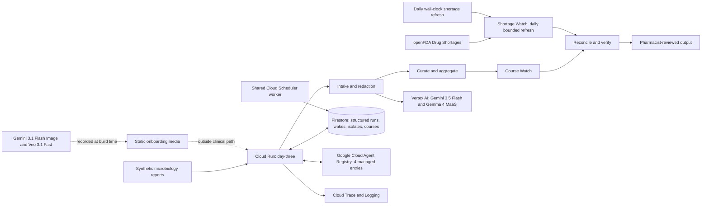

# Day Three: the review that should not get lost

**An agentic antimicrobial-stewardship console for small and critical-access hospital teams.**

Day Three turns synthetic microbiology reports into a privacy-protected local antibiogram, keeps a
five-week antibiotic-course review ladder alive, and prepares a source-grounded reconciliation for
a pharmacist. Its background worker also filters official openFDA shortage data to the demo
formulary. The agent carries the context and the clock; the pharmacist keeps the decision.

> **New here?** Open the live app, press **Start from a clean slate**, and follow the numbered
> controls. Nothing in the demo uses real patient data.

- [Open the live application](https://day-three-109051079423.us-central1.run.app)
- [Read the judge evidence](https://day-three-109051079423.us-central1.run.app/judges)
- [Inspect machine-checkable conformance](https://day-three-109051079423.us-central1.run.app/conformance)

## Judge it in 90 seconds

1. Press **Start from a clean slate**.
2. Press **Load report** three times: watch a local cumulative antibiogram appear.
3. Run **Test a report with hidden instructions**: the prompt-injection text is quarantined.
4. Admit the synthetic course, advance **47 hours**, then **5 more hours**: the durable wake fires.
5. Press **Ask the day three question**: inspect the cited, pharmacist-reviewable draft.
6. Press **Test an unsupported number**: the verifier rejects the fabricated claim.

The interface explains each action before and after it runs. A first-time judge never needs a
terminal, credentials, or prior clinical knowledge.

## Verified evidence

| Gate | Reproducible result |
|---|---:|
| Deployed public acceptance flow | **18/18** |
| Standalone automated tests | **214 passed** |
| Recorded extraction fields | **29/29** |
| Shared-substrate exit test | **10/10** |
| Accessibility gate | **Pass: light and dark themes** |

The recordings, adjacent truth files, grading reports, tests, and acceptance script are committed.
These numbers describe the shipped synthetic fixtures. They are not estimates or clinical-outcome
claims.

## The problem

Small and critical-access hospitals may have less specialist time, fewer local isolates, and less
capacity to keep every review moving. A broad antibiotic may be started before a culture is final;
when the result arrives around the 48-to-72-hour review window, the evidence and the responsible
human still need to meet.

Day Three focuses on that coordination gap. It keeps the original report, uncertainty, local
cumulative context, wake status, and human-approval boundary together from intake to review.

## What happens end to end

| Stage | What the system does | What remains human-controlled |
|---|---|---|
| **1. Read** | Transcribes a synthetic microbiology report and removes direct identifiers before model review. | No real patient report enters this project. |
| **2. Curate** | Normalizes organism and susceptibility fields, preserves provenance, and rejects unsupported values. | Ambiguous or unsupported facts are not silently filled in. |
| **3. Aggregate** | Builds a deliberately small cumulative antibiogram with first-isolate handling and low-count suppression. | It is a demonstration view, not a certified laboratory report. |
| **4. Wait** | Registers the complete five-week wake ladder in durable state, then sleeps until work is due. At hour 48, a claimed wake invokes reconciliation against the latest persisted isolate. | The production clock remains wall-clock driven. Missing culture data triggers one bounded recheck, never a guess or infinite loop. |
| **5. Reconcile** | Compares the final result with the synthetic course, local grid, and latest source-dated national shortage signal, then verifies and stores a cited draft automatically. | A pharmacist verifies local inventory and decides whether any clinical action is appropriate. |
| **6. Verify** | Rejects fabricated percentages, missing support, and claims outside the narrow task. | The service cannot prescribe, dose, order, page, or edit a chart. |

## Architecture



The solid path below is the live stewardship workflow. The dotted path is optional onboarding
media generated at build time. It never sees reports and never participates in a clinical output.



The nine logical roles are Python modules and route stages inside one `day-three` Cloud Run
service. They are not nine services. Four cross-department capabilities are also registered as
standard REST agents in Google Cloud Agent Registry and can be queried through the public
[`/day-three/registry/managed`](https://day-three-109051079423.us-central1.run.app/day-three/registry/managed) proof route. There is no Pub/Sub hop. The deployed service runs as `sa-reason`,
while the separately provisioned identities document intended privilege boundaries rather than
pretending there is per-agent runtime isolation.

Day Three and Sixty Days share a durable substrate, but their public services, repositories, and
simulation clocks are separate. Simulated wake claims are filtered by owning project; the shared
production worker remains unfiltered and wall-clock based.

- [Diffable Mermaid source](docs/architecture.mmd)
- [Recorded media provenance: prompts, model IDs, sizes, and SHA-256 hashes](app/web/media/bonus-media-provenance.json)
- [Bonus evidence map](BONUS_EVIDENCE.md)

### Known conformance deviation

CLSI selects the earliest isolate by collection date. The current curator keeps the first isolate
ingested. These agree when reports arrive in collection order, but a delayed earlier report will
not replace the profile already counted. The patient still contributes exactly one isolate, so the
count remains correct; the selected susceptibility profile can differ. The public conformance route
discloses this limitation explicitly.

## Why each model is here

| Model | Narrow job | Boundary |
|---|---|---|
| **Gemini 3.5 Flash** | Structured transcription of synthetic reports. | Output is schema-validated and graded against adjacent truth. |
| **Gemma 4 MaaS** (`gemma-4-26b-a4b-it-maas`) | Second-pass privacy review after deterministic redaction. | It does not make clinical recommendations. |
| **Gemini 3.1 Flash Image** | Creates the optional abstract first-use briefing. | Build-time media only; no patient data or clinical values. |
| **Veo 3.1 Fast** | Creates the optional four-second motion briefing. | Muted, user-controlled, and outside the clinical path. |

The extra models are useful, visible, and auditable. They are not decorative claims attached to
the core workflow.

## Safety and data boundaries

- Synthetic composite reports only; no protected health information or real patient records.
- Deterministic patterns run before model-bound text; Gemma provides a second privacy review.
- Every shipped fixture identifier has regression coverage, including names, addresses, and case references.
- Recommendations must cite observable source fields; the verifier can abstain or reject.
- Every source reference must contain a nonempty quote; one valid reference cannot launder an empty one.
- Percentages are suppressed below the selected low-isolate threshold.
- openFDA is a national availability signal, refreshed at most once per 24 hours and never treated as local inventory or medical advice.
- No autonomous prescribing, dosing, messaging, paging, ordering, or chart mutation.
- The router persists a review escalation; it does not contact a clinician.

## Research and citations

Research changed the product, not just the pitch. National adoption data changed the framing from
"hospitals lack programs" to **teams need help executing consistently**. Critical-access studies
motivated durable handoffs. Low-isolate evidence led to suppression rather than false precision.

### Complete source list

1. [CDC: Core Elements for Small and Critical Access Hospitals](https://www.cdc.gov/antibiotic-use/media/pdfs/core-elements-small-critical-508.pdf) supports adaptable local practice and pharmacist leadership; it does not validate this product.
2. [CDC: Core Elements of Hospital Antibiotic Stewardship Programs](https://www.cdc.gov/antibiotic-use/hcp/core-elements/hospital.html) supports prospective audit, feedback, tracking, and reporting; Day Three does not perform preauthorization.
3. [CDC: Antibiotic Use and Stewardship in the United States, 2025 Update](https://www.cdc.gov/antibiotic-use/hcp/data-research/stewardship-report.html) reports 97% adoption of all seven Core Elements and 16% adoption of all six newer priorities among acute-care hospitals reporting in 2024; national self-reported context, not a CAH rate.
4. [CDC NHSN: Reducing Carbapenem Use in a Critical Access Hospital](https://www.cdc.gov/nhsn/au-case-examples/reducing-carbapenem-use.html) describes one CAH pairing an antibiogram with prospective telepharmacist review; this is a case example, not an outcome forecast.
5. [Ryder et al.: evaluation of 21 selected Iowa/Nebraska programs](https://pmc.ncbi.nlm.nih.gov/articles/PMC10594270/) reports bounded barriers including time/personnel, expertise, and electronic-record limitations; this is not national prevalence.
6. [Kassamali-Escobar et al.: process evaluation in 19 CAHs](https://pmc.ncbi.nlm.nih.gov/articles/PMC11574594/) reports staffing, turnover, and bandwidth barriers; this is not proof that software removes them.
7. [GRAM Project: global burden of bacterial antimicrobial resistance](https://pubmed.ncbi.nlm.nih.gov/39299261/) provides global problem context; Day Three never claims to prevent a quantified number of deaths.
8. [Low-isolate reliability analysis](https://pmc.ncbi.nlm.nih.gov/articles/PMC9927543/) shows instability in small cumulative samples and motivates low-count suppression.
9. [Review of antimicrobial de-escalation timing](https://www.ncbi.nlm.nih.gov/pmc/articles/PMC11776815/) supports review around 48 to 72 hours; the product still waits for final, supported evidence.
10. [Systematic review of stewardship cost evidence](https://aricjournal.biomedcentral.com/articles/10.1186/s13756-019-0471-0) provides historical context from included studies; its savings are not claimed as Day Three results.
11. [Systematic review and meta-analysis of de-escalation](https://www.mdpi.com/2813-0618/2/4/25) provides outcome context from included studies; its length-of-stay finding is not a product promise.
12. [Google Cloud Agent Registry overview](https://docs.cloud.google.com/agent-registry/overview) defines the managed discovery and governance plane; Day Three uses four manually registered standard REST agents and does not claim Agent Runtime or per-agent identity.
13. [Google Cloud manual agent registration](https://docs.cloud.google.com/agent-registry/register-agents) documents standard REST registration through a Service resource and discovery through the projected Agent resource.
14. [openFDA Drug Shortages](https://open.fda.gov/apis/drug/drugshortages/) documents the daily public feed and warns against medical-care decisions; the watcher preserves that warning and requires pharmacist review.

For the source hierarchy, exact source-to-decision mapping, and rejected claims, read the
[research traceability ledger](docs/research-traceability.md).

## Reproduce locally

Prerequisites: Python 3.12. New live model calls also require Application Default Credentials
for a Google Cloud project with Vertex AI enabled.

```bash
cd app
python -m venv .venv
.venv/bin/pip install -e ".[dev]"
python -m pytest -q
python scripts/check_a11y.py
```

Run deterministically with the committed recordings:

```bash
export GOOGLE_CLOUD_PROJECT=agentic-fleet-2026
export SIM_MODE=true
export REPLAY_MODE=true
uvicorn service.main:app --reload
python scripts/demo_flow.py --url http://127.0.0.1:8000
curl -X POST -H "Content-Type: application/json" -d '{}' http://127.0.0.1:8000/exit-test
```

Deploying from `app/` with `bash deploy.sh` targets the independent Cloud Run service `day-three`.
The explicit empty JSON body in the exit-test request matters; a bodyless POST receives HTTP 411.
Managed discovery is reproducible with `python infra/register_agents.py`; the script creates or
updates the four standard REST entries. See `app/infra/README.md` for the editor and viewer IAM
commands and the public verification route.

## Repository map

- `app/day_three/`: project domain logic
- `app/spine/`: copied, reviewed runtime substrate required by this standalone project
- `app/service/`: public and operational routes
- `app/fixtures/`: synthetic inputs, adjacent truth, and recorded model outputs
- `app/tests/`: unit, integration, claim, safety, and UI-contract tests
- `app/scripts/`: recording, grading, accessibility, demo, and deployment verification
- `docs/research-traceability.md`: source-to-product decisions and rejected claims
- [Validation evidence](VALIDATION_EVIDENCE.md): research-to-test evidence, adversarial checks, and explicit limits
- [Project differentiation](PROJECT_DIFFERENTIATION.md): concrete separation from the other submission and shared-spine disclosure
- `SUBMISSION_KIT.md`: evidence-backed demo and Devpost copy

## Disclosure

Built during the contest period with AI coding assistants. All public demonstration data is
synthetic. Model output is measured against committed truth and is never presented as clinical
advice. No government, healthcare organization, or standards body endorses this project.
