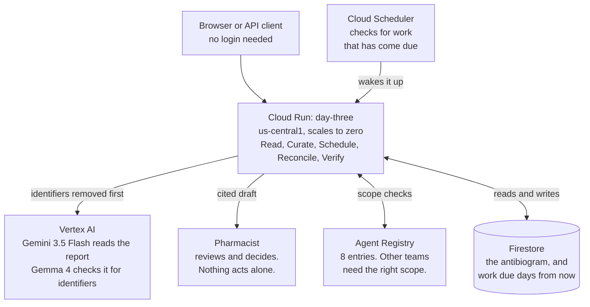

# Day Three: Submission Kit

The execution kit for the final submission artifacts. Product statements in this file must match
the deployed system and the current claim audit; aspirational beats are labelled conditional.

Scorecard context: the 18-step deployed flow, public README, standalone repository, submission-ready
architecture SVG, three additional Google model integrations, and the public build story are complete.
The final video and social publication remain external steps. Bonus evidence is specified in `BONUS_EVIDENCE.md`.

---

## 1. Complete: the console's headline path runs on recorded real model output

Implemented and protected by the deployed acceptance flow:

- `btn-report`: fetch `/day-three/fixtures/{next in rotation}`, ingest with its recorded
  `extraction` and its `ground_truth` as the document; prepend to the stream a thumbnail of
  `/day-three/fixtures/{name}/image` (max-height 120px, click opens full size in a new tab) with
  the caption: "Read by Gemini 3.5 Flash. Recorded output, graded 29/29 against ground truth."
- `btn-hostile`: fetch `ecoli_urine_with_note` the same way.
- No hand-written `EXTRACTION` constant remains in the ingest path.
- Acceptance asserts the intake response came from a fixture recording and that the grid reflects
  the output. Current deployed result: 18/18.

## 2. The 4-minute video

Scored against four things the rules name: the friction is clear, the architecture is clear, the
execution is **live and unedited**, and Google Cloud is **visible on screen**. Everything below
serves one of those four. Anything that did not has been cut, including the shortage watcher, the
conformance page and the judges page. A feature tour scores worse than three things a judge
believes.

### Before you record

1. Press **Start from a clean slate**, or `curl -X POST -d '{}' $BASE/sim/reset` and
   `$BASE/day-three/reset`. Every `demo_flow.py` run leaves 52 hours of clock drift.
2. Fresh browser profile, 1440x900, no bookmarks bar, no extensions, DevTools closed.
3. Light theme. Second tab already open on the Cloud Run console page for `day-three`.
4. One continuous take from 0:20 to the end. The rules reward unedited execution; cuts read as
   something to hide.
5. Rehearse once. The live model call takes 20 to 30 seconds and you must talk through it.

### The shot list

Narration is verbatim. Times are targets with about ten seconds of total slack.

| Time | On screen | Say exactly |
|---|---|---|
| 0:00 | Landing hero | "If you go into hospital with a serious infection, treatment starts before anyone knows which bacteria it is. Two days later the lab result arrives, and it often means a narrower, safer antibiotic would work. Someone has to notice. In a small hospital with no infectious-disease specialist, that review quietly gets missed." |
| 0:20 | Scroll to the second card, press **Start a real timer** | "Before I show you anything, I'm starting a timer on the real clock. I can't speed it up. Nothing on this page can. We'll come back to it." |
| 0:35 | Press **Start from a clean slate**, then **Load report** three times | "This hospital has never had a resistance picture of its own. Three cultures come back. Watch the grid build. Every value had to be quoted word for word off the page; anything the AI couldn't point to is thrown away, not guessed. And where there are too few samples, it prints no percentage at all. That's the CLSI standard, and it matters in a moment." |
| 1:15 | Press **Admit patient**, then **Advance 47 hours** | "A patient starts a broad antibiotic. One agent books five check-ins across the next fourteen days and goes to sleep. Forty-seven hours pass. Nothing is due, so nothing happens, and sleeping costs nothing." |
| 1:30 | Press **Advance 5 hours** | "Five more hours. Now it wakes itself. Nobody clicked it awake and nobody was watching. It found its own work was due." |
| 1:45 | Press **Ask day-three question** | "It asks the question nobody was there to ask: is this still the right drug? It says narrow to nitrofurantoin, and every sentence is pinned to a quoted line of the lab report. Then it stops and waits for a pharmacist. It cannot prescribe, cannot change an order, cannot page anyone." |
| 2:10 | Press **Challenge unsupported number** | "This is the part I care about most. I ask it to state a resistance rate for a cell with too few samples. There is no such number. It invents one, and the verifier rejects it and says why. Nothing reaches a human here unless its evidence is real." |
| 2:30 | Press **Read a lab report now** | "Everything you've seen replayed a saved AI answer, and the page says so. That's fair to be sceptical about. So here is the same scan going to Gemini on Vertex AI right now, live, while you watch, with just the picture and no text to copy from. Scored against the same answer key as the number we published." |
| 3:00 | The result appears | "Eight of eight, nothing invented. Not a recording." |
| 3:10 | Scroll up to the timer, now fired | "And the timer. Fired on the real clock while I was talking. Booked at one time, claimed at another, by a scheduled worker, with nobody watching. That's the whole product in one line: it carries the clock so a person doesn't have to." |
| 3:30 | Switch tab to Cloud Run console, then `/day-three/platform` | "This runs on Cloud Run in us-central1 and scales to zero. Firestore holds the state, Cloud Scheduler wakes it, and this route reads the managed agent platform live: four runtime identities, a governed gateway, and two Model Armor templates. Not a slide." |
| 3:50 | Back to the landing page | "Day Three doesn't practise medicine. It makes sure the review that gets missed actually happens, with the evidence already assembled, and a pharmacist still deciding." |

### Why each beat is there

- **0:00** is the friction, in one patient, with no statistics. Judges watch a hundred of these.
- **0:20** plants the bookend. It costs eight seconds and buys the strongest moment in the video.
- **0:35 to 1:45** is the agent doing the work: UI changing, state changing, unattended wake.
- **2:10** and **2:30** are the two moments most entries cannot show: a system that refuses, and a
  model call that happens on camera.
- **3:30** is the required Google Cloud proof, and it lands better after the product, not before.

### If something goes wrong on camera

- **Live call refused with 429.** The daily budget is spent. Say so, and say why the cap exists:
  it is a credential-free route that costs real money. Then keep going. An honest cap is a better
  look than a hidden one.
- **Timer not fired at 3:10.** It fires within sixty seconds of becoming due. Say "it's due, the
  worker picks it up within the minute", carry on to Cloud Run, and come back. Do not cut.
- **Live call slow.** It is transcribing a photo. Narrate the boundary while it runs; do not sit
  in silence and do not stop the recording.

### Upload

YouTube, public, English captions on, auto-generated then corrected. Title: "Day Three: the
antibiotic review that gets missed". First line of the description: the live URL, then the repo.

## 3. Architecture diagram

Use the committed submission-ready docs/architecture.svg for Devpost and the video still. It is
1600 by 900, accessible, and distinguishes the live clinical path from recorded onboarding
media. The canonical Mermaid source remains below. If Devpost requires PNG instead of SVG,
render it at 2x; keep the diagram readable at video resolution and under roughly twelve boxes.

Caption under the diagram, verbatim: "Storage and compute are pinned to us-central1 and enforced
by code. Gemini 3.x is served only globally; the redaction gate is why crossing that boundary is
acceptable. The two public checks on the left are the ones a judge can run without a credential."

## 4. README skeleton (repo root)

Order fixed; each bullet is a section with listed content. Reuse `/judges` text; do not rewrite.

1. Title + one-line tagline + live URL + 30-second GIF of the wake beat
2. The problem (3 short paragraphs from the landing page) + the four cited stats
3. What it does: the 9 implemented logical roles and 8 managed registry entries from the site
4. **Run it in five minutes**: the exact command table from `/judges` (tests, indexes, deploy,
   exit-test, demo_flow) because Rules line 425 scores this as proof of reproducibility
5. Architecture: the diagram + caption + link to `spine/TECHNICAL_DESIGN.md`
6. Measured model accuracy: the 29/29 table + how to regenerate (`record_intake.py`)
7. What it does not do (safety box, from the site, verbatim)
8. Findings and learnings: lift the six `details` items from `/judges`
9. Conformance: link + one-paragraph explanation of standards-instead-of-testimonials
10. Disclosure: spine built during submission period; AI coding assistants used; synthetic data
    only; no endorsements

## 5. Devpost submission text (paste-ready fields)

- **Category:** The Fortified Enterprise Fleet
- **Tagline:** The antibiotic review limited teams can miss.
- **Description:** landing page problem text + who it's for + the three how-it-works cards
- **Features/functionality:** 9-role table + managed Agent Registry proof + the three track mandates
- **Tech:** Gemini 3.5 Flash (Vertex AI, measured 29/29), Gemma 4 MaaS, Gemini 3.1 Flash Image, Veo 3.1 Fast, GenAI SDK,
  Cloud Run, Firestore, Cloud Scheduler, Google Cloud Agent Registry, Agent Runtime, Agent Identity, Agent Gateway, Memory Bank, Model Armor, Cloud Trace/Logging, Artifact Registry, Cloud Build,
  OpenTelemetry. Pub/Sub is not used. Secret Manager stores the invitation code and expiring beta-key records.
- **Data sources:** synthetic composite patients; synthetic degraded scans with ground truth;
  official openFDA Drug Shortages; CLSI M39 rules; public stewardship literature (cited)
- **Beyond the demo (paste as its own paragraph):** The console is the evaluation surface, not
  the product boundary. The same intake, quoting, redaction and suppression path is exposed as a
  tenant-scoped `/v1` API. An approved integration sends de-identified microbiology text with an
  `X-API-Key` and gets back its own private cumulative antibiogram; a different key is a different
  hospital with entirely separate data, verified live. Keys are stored as hashes only, issued
  behind an invitation code, expire after seven days, and are revocable from the Developer page.
  Raw report text is never persisted, low-count cells stay suppressed, and no endpoint can
  prescribe, dose, order, page, or change a chart. That is the path from a hackathon console to a
  small hospital pointing its own lab feed at it, without the demo pretending to be a deployment.
- **Findings and learnings:** the six `/judges` findings, trimmed to ~200 words
- **Hosted URL:** `https://day-three-109051079423.us-central1.run.app`
- **Video URL:** filled after the public upload
- **Repo URL:** `https://github.com/usv240/day-three` (public)

## 6. Final submission checklist

- [ ] Public YouTube or Vimeo video under four minutes with corrected English captions
- [ ] Live Cloud Run proof visible in the video
- [x] Public hosted project, no credentials required
- [x] Public standalone repository
- [x] Submission-ready architecture SVG plus canonical Mermaid source
- [x] Three additional Google model integrations with public prompts and hashes
- [x] 18/18 acceptance, 283 tests, accessibility, and 10/10 shared-substrate exit test
- [x] Credential-free live Gemini call on the public page, budget-capped and graded
- [x] Wall-clock wake proof a visitor can register and verify afterwards
- [x] LICENSE committed
- [x] Public build story published: https://dev.to/ujwal240/the-antibiotic-review-that-software-quietly-forgets-2ane
- [x] Public build story URL ready for the Day Three Devpost submission
- [ ] Publish docs/social-post.md with #AllThingsAgenticHackathon and add its public URL
- [ ] Final link and citation check immediately before Devpost submission
- [ ] Freeze the submitted revision and keep it available through judging
